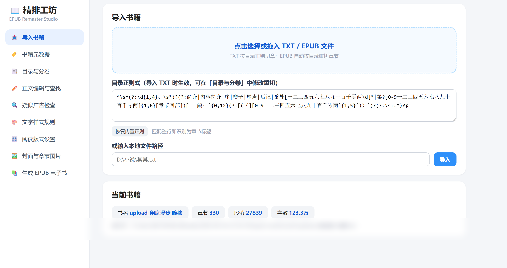

# EPUB 精排工坊

一个**本地运行**的中文小说 EPUB 精排工具：把 TXT / 粗糙 EPUB 一键加工成排版精致、带封面、头图、插图、自定义字体的 EPUB，适配墨水屏阅读器（Kindle、文石、掌阅等）与手机阅读 App。

纯本地运行，不联网、不上传任何数据。界面为网页（Flask + 单页前端），操作方式类似简化版 Calibre。

## 界面预览

**导入书籍**（TXT 按正则自动切章 / EPUB 按目录重切）：



**字体管理 + 注释样式 + 文字样式规则**（多字体槽位自动子集化，引号/括号等规则各自定制字体颜色字号）：


**封面与章节头图**（14 种边缘蒙版样式，每种带示意图）：


## 功能一览

- **导入**：TXT（自动切章，支持自定义章节正则、重新切章）/ EPUB（按原目录重切）
- **章节管理**：增删改、合并上一章、合并重复章节、标题规范化、分卷（卷→章两级目录）
- **查找替换 & 广告清理**：全文查找替换；广告正则扫描/删除，内置 4 组常见小说站广告预设，可自定义
- **字体**：多字体槽位（正文 body / 对话 dlg / 章标题 title / 目录 toc + 自定义），上传 TTF/OTF 后**自动按书中字符集子集化**嵌入，大幅压缩体积
- **文字样式规则**：引号（「」『』""''）、括号、作者有话说等块/行内规则，各自独立的字体/颜色/字号/粗斜体；内置预设 + 自定义正则
- **注释**：`{{注:内容}}` 语法，章末脚注 + 双向跳转，样式可自定义
- **阅读版式**：四边距（百分比，不随字号膨胀）、段距、行距、首行缩进、首字下沉、自定义 CSS
- **封面**：上传封面，尺寸可调（最大宽度 px，0 = 原图）
- **章节头图**：多张轮换，宽高/边距可调，**11 种边缘样式**（方正/云边/雾边/拖墨/糙圆/晕染/胶片/撕边/撕框/笔刷/毛边），每种都有示意图
- **插图**：全屏插图（每 N 章 / 指定章节后 / **按正文文字定位**）、正文内插图（**可在正文编辑中选中文字一键插入**，或按段号定位；宽度、左右环绕）
- **目录页**：独立目录页，背景图多张轮换、**背景图显示尺寸可调**、底栏透明度可调、目录字体独立设置、瘦金体等任意字体
- **自定义 CSS**：正文编辑页可直接追加 CSS 规则（含常用片段按钮）
- **书籍元数据**：作者、简介、出版社、ISBN、出版日期、标签（dc:subject）
- **图片压缩**：30% / 50% / 70% / 原图
- **配置档案**：字体、文字样式规则、注释样式自动跨书籍继承，换书不用重配
- **自定义保存位置**：生成的 EPUB 可输出到任意目录，并记住上次选择

## 快速开始

环境：**Python 3.10+**（Windows / macOS / Linux 均可）

```bash
pip install -r requirements.txt
python server.py 8642
```

然后浏览器打开 <http://localhost:8642>。

Windows 用户也可以直接双击 `启动工坊.bat`（首次运行自动安装依赖并打开浏览器）。

使用流程：导入书籍 → （可选）清理广告 → 文字样式页上传字体、配规则 → 封面与章节图片页传图选样式 → 生成 EPUB。

## 目录结构

```
epub-studio/
├── server.py        # Flask 后端（API + 构建调度）
├── epub_core.py     # 构建核心（解析/样式引擎/蒙版/EPUB 组装/字体子集化）
├── static/
│   └── index.html   # 单页前端
├── docs/            # README 截图
├── requirements.txt
└── work/            # 运行时自动生成：当前书籍、素材、字体、输出（已在 .gitignore）
```

## 注意事项

- **字体版权**：请使用你合法获得的字体文件。商用字体（如汉仪、方正旗下字体）授权通常**不允许再分发**，请勿将字体文件上传到公开仓库；嵌入个人自用的电子书一般属于合理使用范畴，具体以字体授权条款为准。
- **内容合规**：本工具仅供整理**个人合法获得**的文本，请勿用于制作或传播侵权内容。
- 生成新书后，阅读器 App 可能缓存旧书，请删除旧书再重新导入。

## 许可证

[MIT](LICENSE)
